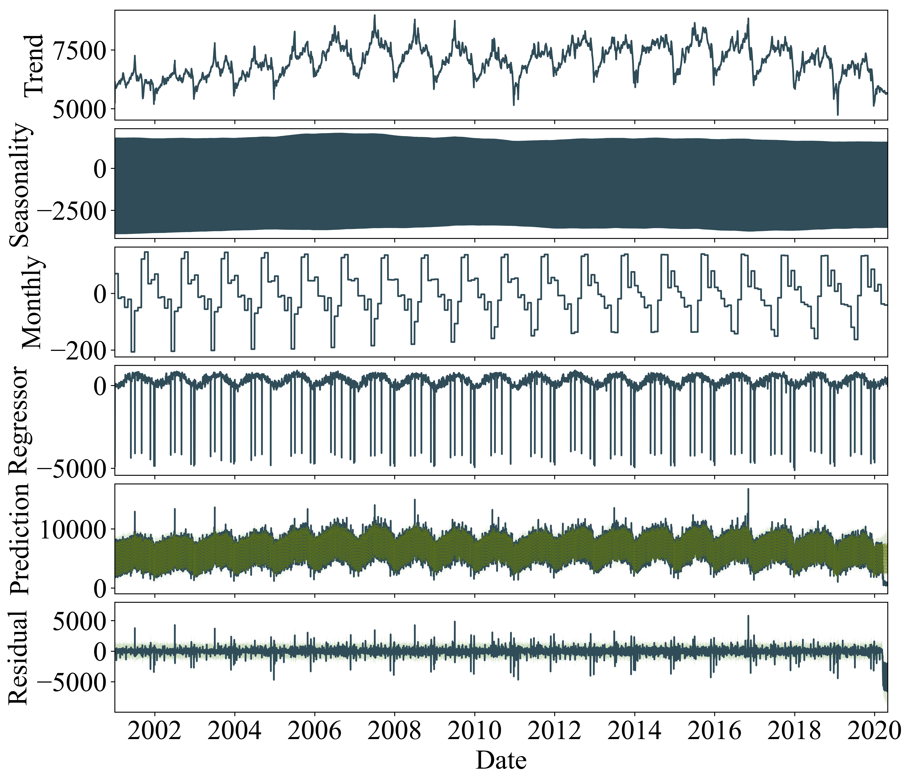
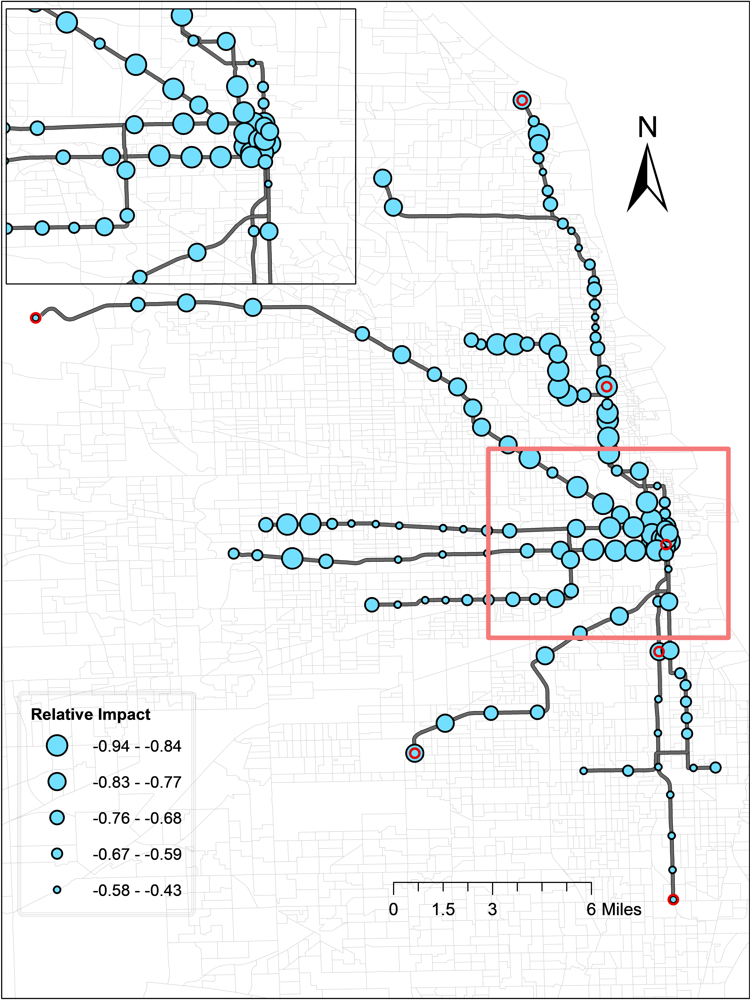

# Who left riding transit? Examining socioeconomic disparities in the impact of COVID-19 on ridership

#### Songhua Hu, Peng Chen 
The COVID-19 pandemic has led to a globally unprecedented decline in transit ridership. 
This paper leveraged the 20-years daily transit ridership data in Chicago to infer the impact of COVID-19 on ridership using the Bayesian structural time series model, 
controlling confounding effects of trend, seasonality, holiday, and weather. 
A partial least square regression was then employed to examine the relationships between the impact of ridership and various explanatory factors.

## Data
* Daily_Lstaion_Final.csv: Ridership+Weather, the input to build BSTS.
* finalCoeff_Transit_0810.csv: Coeff from BSTS
* finalImpact_Transit_0810_old.csv: Causal Impact from BSTS [Describe p-value of impact based on this file]
* Impact_Sta.csv: impact of each station
* All_final_Transit_R_0812.csv: features to build PLS
* Other data are available at: https://drive.google.com/drive/folders/1OxtPze9qI-tNz3VLw5-7hvPf4y-M3J_g?usp=sharing

## Code
* 1-L_Station_Ridership_Prepare.py: Finish the time-series preprocessing.
* 2-BSTS_Causal_Impact.R: Build the BSTS and infer the causal impact.
* 3-EDA_BSTS_Result.py: Visualize the results from BSTS.
* 4-Feature_Build.py: Build the features matrix for PLS models.
* 5-PLS_Build.R: Finish the PLS model fit.

## Results
#### Decomposition of one transit station ridership time series in the BSTS model.

#### Spatial distribution of the relative impact during the COVID-19 pandemic.

